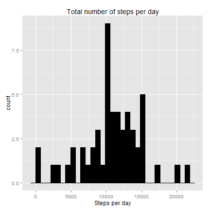
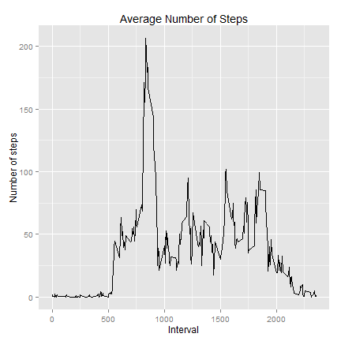
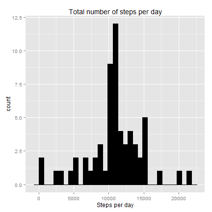
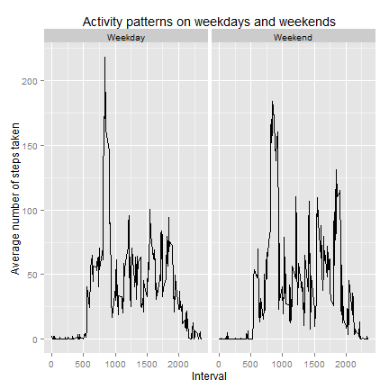

Reproducible Research: Peer Assessment 1
========================================

##Part 1
###Loading and preprocessing the data
###Setup knitr options.


```r
opts_chunk$set(message = FALSE, fig.width = 6, fig.height = 6)

#Load needed libraries.
require(plyr)
```

```
## Loading required package: plyr
```

```
## Warning: package 'plyr' was built under R version 3.1.3
```

```r
require(ggplot2)
```

```
## Loading required package: ggplot2
```

```
## Warning: package 'ggplot2' was built under R version 3.1.3
```

```r
#Read in data file and transform date to correct format
activity <- read.csv("activity.csv", header = TRUE)
activity <- transform(activity, date = as.Date(date))
```

##Part 2
### What is mean total number of steps taken per day?


```r
#Find the total number of steps taken per day.
stepsPerDay <- ddply(activity, ~date, summarise, steps = sum(steps))

#Plot a histogram of the total number of steps taken per day.
p <- ggplot(stepsPerDay, aes(steps))
p <- p + geom_histogram(fill = "blACK", color = "black")
p <- p + ggtitle("Total number of steps per day")
p + xlab("Steps per day")
```

 

```r
#Compute the mean and median total number of steps taken per day.
meanStepsPerDay <- mean(stepsPerDay$steps, na.rm = TRUE)
medianStepsPerDay <- median(stepsPerDay$steps, na.rm = TRUE)

mean(meanStepsPerDay)
```

```
## [1] 10766.19
```

```r
median(medianStepsPerDay)
```

```
## [1] 10765
```


##Part 3
###What is the average daily activity pattern?


```r
#Find the average number of steps taken per 5 minute interval.
avgStepsPerInterval <- ddply(activity, ~interval, summarise, 
                      mean = mean(steps,na.rm = T))

nrow(avgStepsPerInterval)
```

```
## [1] 288
```

```r
#Make a time series plot of the 5-minute interval and 
#the average number of steps taken and averaged across all days.

p <- ggplot(avgStepsPerInterval, aes(interval, mean)) + geom_line()
p <- p + ggtitle("Average Number of Steps")
p + xlab("Interval") + ylab("Number of steps")
```

 

```r
#Find the 5-minute interval that contains the maximum number of steps on 
#average across all the days in the dataset.

maxstep <- which.max(avgStepsPerInterval$mean)
maxInterval <- avgStepsPerInterval$interval[maxstep]
#maxstep is 104
#maxinterval is 835
```


##Part 4
###Imputing missing values


```r
#Calculate the total number of missing values in the dataset.
countNA <- nrow(subset(activity, is.na(activity$steps)))
#2304

#Create a function replacing the NA's step by the mean of 5-minute interval 
#averaged across all days.
na.replace <- function(activity) {
    ddply(activity, ~interval, function(dd) {
        steps <- dd$steps
        dd$steps[is.na(steps)] <- mean(steps, na.rm = TRUE)
        return(dd)
    })
}

#Create a new dataset that is equal to the original dataset but with the 
#missing data filled in.
newActivity <- na.replace(activity)


#Find the total number of steps taken each day.
newStepsPerDay <- ddply(newActivity, ~date, summarise, steps = sum(steps))


#Plot a histogram of the total number of steps taken each day.
p <- ggplot(newStepsPerDay, aes(steps))
p <- p + geom_histogram(fill = "black", color = "black")
p <- p + ggtitle("Total number of steps per day")
p + xlab("Steps per day")
```

 

```r
#Calculate mean and median total number of steps taken per day.
newMeanStepsPerDay <- mean(newStepsPerDay$steps)
newMedianStepsPerDay <- median(newStepsPerDay$steps)

mean(newMeanStepsPerDay)
```

```
## [1] 10766.19
```

```r
median(newMedianStepsPerDay)
```

```
## [1] 10766.19
```

```r
#The imputation is slightly impacted on the median total number of steps taken per day.
#It was changed from 10765 to 10766.19. 
#The mean total number of steps taken per day remains the same. 
```

##Part 5
###Are there differences in activity patterns between weekdays and weekends?


```r
#Create a new factor variable weekpart in the dataset with two levels "weekday" and "weekend"

weekParts <- c("Weekday", "Weekend")
date2weekpart <- function(date) {
  day <- weekdays(date)
  part <- factor("Weekday", weekParts)
  if (day %in% c("Saturday", "Sunday")) 
    part <- factor("Weekend", weekParts)
  return(part)
}


newActivity$weekpart <- sapply(newActivity$date, date2weekpart)


#Plot a panel containing a time series plot of the 5-minute interval and
#the average number of steps taken, averaged across all weekday days or weekend days.

avgSteps <- ddply(newActivity, .(interval, weekpart), summarise, mean = mean(steps))

p <- ggplot(avgSteps, aes(x = interval, y = mean))
p <- p + geom_line() + facet_grid(. ~ weekpart, )
p <- p + ggtitle("Activity patterns on weekdays and weekends")
p + xlab("Interval") + ylab("Average number of steps taken")
```

 
